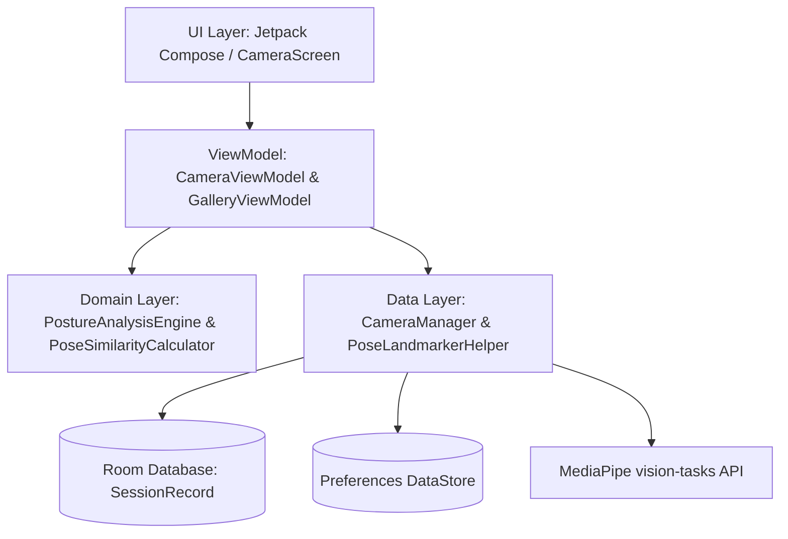

<p align="center">
  
</p>

<h1 align="center">Pose Pilot</h1>

<p align="center">
  <strong>Align. Focus. Capture.</strong><br>
  An intelligent, real-time posture coaching and photography assistant for Android.
</p>

<p align="center">
  <a href="https://kotlinlang.org"></a>
  <a href="https://developer.android.com/about/versions"></a>
  <a href="https://developers.google.com/mediapipe"></a>
  <a href="https://developer.android.com/about/versions"></a>
</p>

---

## 🌟 Overview

**PosePilot** is a state-of-the-art Android application that leverages **Google MediaPipe Tasks-Vision** to analyze human body language and posture in real-time. It acts as an interactive photography coach, guiding subjects to stand straight, level their shoulders, and frame themselves perfectly using advanced computational photography principles.

---

## ✨ Features

- **🤖 Real-time Skeletal Overlay:** Renders a 33-point body skeleton tracked via MediaPipe with instant feedback.
- **🎙️ Vocal Coaching Manager:** Provides real-time audio corrections (e.g., *"Level your shoulders a little"*) with custom speech throttling to prevent repetitive announcements.
- **📸 Smart Shutter (Auto-Capture):** Automatically triggers a countdown timer (3s or 5s) once the subject maintains a correct posture configuration (Score $\geq$ 80%) for at least 1 second.
- **📏 Advanced Framing Guides:** Features rule-of-thirds grid lines and an interactive horizon level tracking device roll using hardware rotation sensors.
- **📊 Analytics & Insights Dashboard:** Captures historical posture score logs and presents them in a beautiful custom chart.
- **📁 Scoped Storage Integration:** Standard gallery support including capturing, sharing, and securely deleting photos using modern `RecoverableSecurityException` handling.

---

## 🛠️ Architecture

PosePilot is built on clean, modern Android architecture patterns (MVVM + Clean Architecture + Dependency Injection).



### Key Directories
- **`/app/src/main/java/com/posepilot/app/data`**: Camera implementation, MediaPipe inference helper, Room DB, Datastore, and Sensor listeners.
- **`/app/src/main/java/com/posepilot/app/domain`**: Business rules, analysis heuristics, and matching math.
- **`/app/src/main/java/com/posepilot/app/ui`**: Premium Compose interfaces, theme parameters, and custom canvases.

---

## 🚀 Building & Running

### Prerequisites
- Android Studio Ladybug (or newer)
- JDK 17
- Android SDK 36 (or compiled via wrapper)

### Build Command
To compile the application, run:
```bash
./gradlew compileDebugKotlin
```

### Running Tests
To execute the unit test suite (including posture scoring engine mathematical validations):
```bash
./gradlew test
```

### Generate Debug APK
To build the installable debug APK directly:
```bash
./gradlew assembleDebug
```
The output APK will be generated at:  
`app/build/outputs/apk/debug/app-debug.apk`

---

## 🍏 iOS / iPhone Integration Guide

If you are an iOS developer looking to merge the iPhone codebase into this repository, please follow the unified platform structure outlined below:

### Proposed Repository Layout
```
/                   <-- Root Repository Directory (Android files reside here)
├── app/            <-- Android Application Module
├── ios/            <-- [NEW] iOS Application Xcode Project & Source Code
└── README.md       <-- This unified guide
```

### Step-by-Step Upload Instructions

1. **Clone the Repository:**
   ```bash
   git clone https://github.com/sourishnandy4-cell/PosePilot.git
   cd PosePilot
   ```

2. **Create the iOS Subfolder:**
   Create a folder named `ios` in the root:
   ```bash
   mkdir ios
   ```

3. **Add Your iOS Code:**
   Copy your complete Xcode project files, target sources, and workspace directories directly into the new `ios/` folder. Ensure you ignore system files like `Pods/` or `.xcuserdata/` by updating/adding `.gitignore` rules if needed.

4. **Commit & Push to GitHub:**
   ```bash
   git add ios/
   git commit -m "feat(ios): add initial iOS Swift implementation of PosePilot"
   git push origin main
   ```
