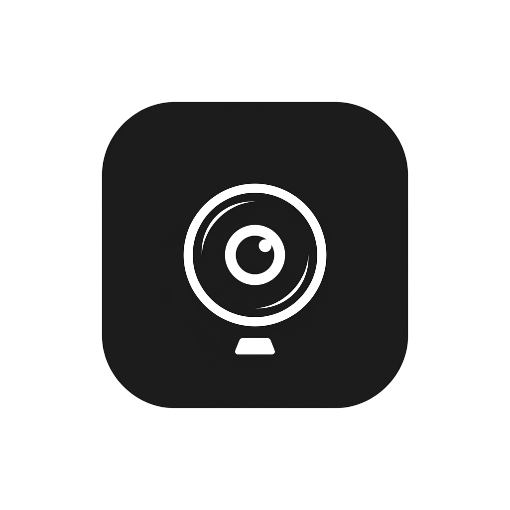

<p align="center">
  
</p>

<h1 align="center">Pose Pilot</h1>

<p align="center">
  <strong>Align. Focus. Capture.</strong><br>
  An intelligent, real-time posture coaching and photography assistant for Android and iOS.
</p>

<p align="center">
  <a href="https://kotlinlang.org"></a>
  <a href="https://developer.android.com/about/versions"></a>
  <a href="https://developers.google.com/mediapipe"></a>
  <a href="https://developer.apple.com/swift/"></a>
  <a href="https://developer.apple.com/ios/"></a>
</p>

---

## 🌟 Overview

**Pose Pilot** is a cross-platform mobile application (with native Android and iOS client implementations) that leverages advanced Computer Vision to analyze human body posture and framing in real-time. It acts as an interactive photography coach, guiding subjects to stand straight, level their shoulders, and frame themselves perfectly.

---

## ✨ Features

### 🤖 Android App
- **Real-time Skeletal Overlay:** Renders a 33-point body skeleton tracked via Google MediaPipe with instant feedback.
- **🎙️ Vocal Coaching Manager:** Provides real-time audio corrections (e.g., *"Level your shoulders a little"*) with custom speech throttling to prevent repetitive announcements.
- **Smart Shutter (Auto-Capture):** Automatically triggers a countdown timer once the subject maintains a correct posture configuration (Score $\geq$ 80%) for at least 1 second.
- **Advanced Framing Guides:** Features rule-of-thirds grid lines and an interactive horizon level tracking device roll using hardware rotation sensors.
- **📊 Analytics & Insights Dashboard:** Captures historical posture score logs and presents them in a beautiful Room-backed custom chart.

### 🍏 iOS App
- **Real-time Skeletal Overlay:** Leverages Apple's native **Vision Framework** (`VNDetectHumanBodyPoseRequest`) for ultra-fast, low-latency 19-point body skeleton tracking.
- **🎙️ Live Guidance & Instruction Banner:** Offers immediate feedback instructions (e.g., *"Move your left hand left"*, *"Level your shoulders"*) dynamically powered by `PoseMatcher`.
- **Smart Shutter (Auto-Capture):** Automatically triggers a countdown timer (3s, 5s, 10s) and captures a photo when the subject maintains a perfect pose configuration (Score > 92%) for 1.5 seconds.
- **🔊 Accessibility VoiceOver Support:** Includes announcement posting to guide visually impaired users step-by-step into the frame.
- **Haptic Feedback:** Vibrates using CoreHaptics to signal skeleton detection and perfect pose alignment milestones.

---

## 🛠️ Architecture

The repository is structured as a unified monorepo containing both the Android and iOS codebases:

```
/                       <-- Root Repository Directory
├── app/                <-- Android Application Module (Kotlin, Compose, Room, DataStore)
├── ios/                <-- iOS Application Project (Swift, SwiftUI, AVFoundation, Vision)
├── app_icon_v2.png     <-- Unified Application Logo
└── README.md           <-- This documentation
```

---

## 🚀 Building & Running

### 🤖 Android
#### Prerequisites
- Android Studio Ladybug (or newer)
- JDK 17
- Android SDK 36 (or compiled via wrapper)

#### Build Commands
- **Compile Kotlin:** `./gradlew compileDebugKotlin`
- **Run Unit Tests:** `./gradlew test`
- **Generate Debug APK:** `./gradlew assembleDebug` (Output path: `app/build/outputs/apk/debug/app-debug.apk`)

---

### 🍏 iOS / iPhone
#### Prerequisites
- macOS machine running Xcode 15 or newer
- Swift 5.10
- iOS device or simulator running iOS 16.0 or newer

#### Build Instructions
1. Open the project in Xcode using the project file:  
   `ios/Pose Camera.xcodeproj`
2. Select your target device (iPhone or Simulator).
3. If building for a physical device:
   - Select the root project target in the sidebar.
   - Go to **Signing & Capabilities**.
   - Check **Automatically manage signing** and select your personal Apple ID/Developer Team.
4. Press `Cmd + R` or click the **Play** button to build and run the application.
